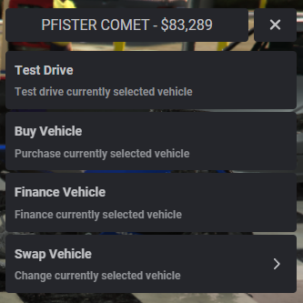
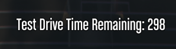
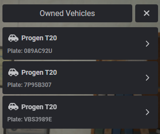
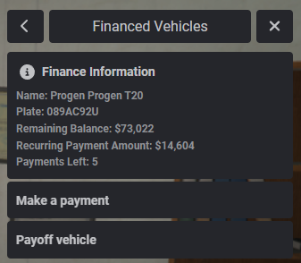

# qbx_vehicleshop

**Test Drives:**
* Can be disabled in config
* Configurable time
* Returns player once time is up
* Can't take out more than one vehicle

**Financing:**
* Can be disabled in config
* Configurable down payment
* Configurable maximum payments
* Configurable commission amount for private dealerships
* Checks for payments due on player join and updates times on player logout or quit

**Shops:**
* Lock to a specific job
* Commission paid to sales person for private dealer
* Create as many as desired with easy polyzone creation
* Vehicle sale amount gets deposited into the cardealer society fund for private dealer

**Vehicle Configuration System**
* The system allows specifying default vehicle shops for all vehicles or categorizing them into specific shops, with the option to apply exceptions. This reduces configuration file sizes by minimizing repetitive entries.

## Previews
**Catalog Main Menu**

**Configurable test drive times that automatically return the player**

**Financed Vehicles Menu Preview**

**Make a payment or pay off vehicle in full**

